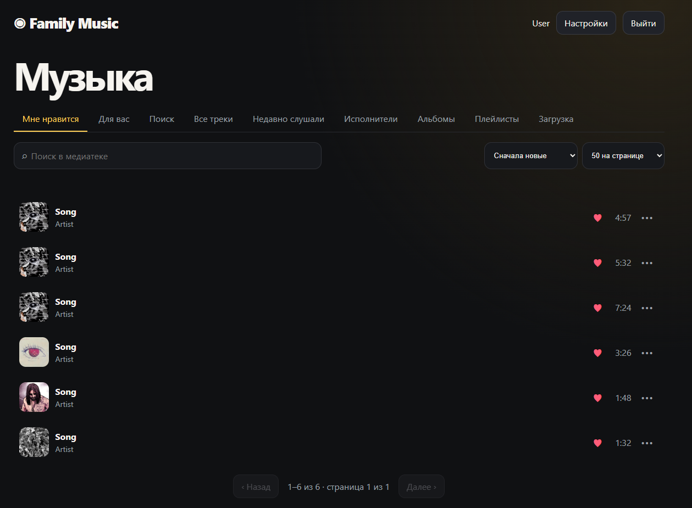

# Family Music

Закрытый семейный музыкальный сервер: HTTP API, web-интерфейс, возобновляемая загрузка аудио и потоковое воспроизведение.

Закрытая федерация доступна как **experimental**-функция для вручную сопряжённых
доверенных нод; она пока не предназначена для открытой сети неизвестных серверов.

## Происхождение проекта

Идея, требования, тестирование и эксплуатация принадлежат **dgl-X**.
Архитектура, весь исходный код и документация текущей версии созданы с помощью
**OpenAI Codex** по запросам владельца и его обратной связи. Подробное честное
описание участия находится в [`AUTHORS.md`](AUTHORS.md).

## Интерфейс

### Web



### Android


## Текущее состояние

Это первый MVP. Работают:

- первичное создание администратора без публичной регистрации;
- пошаговый мастер первого запуска с проверкой сервисов, названием библиотеки
  и базовой настройкой автораспознавания;
- создание обычных семейных аккаунтов администратором без публичной регистрации;
- смена собственного пароля и административный сброс пароля с завершением чужих активных сеансов;
- вход по логину и паролю, серверные сессии в HttpOnly cookie;
- библиотека треков;
- загрузка файла частями по 4 МиБ с проверкой смещения;
- отдельная вкладка массовой web-загрузки файлов и папок перетаскиванием, с очередью, прогрессом, двумя параллельными потоками и повтором ошибок;
- пакетное оформление загруженной папки как альбома: общие метаданные и обложка, номера дисков и дорожек, ручная перестановка;
- постоянная очередь обработки загрузок с восстановлением после перезапуска;
- автоматическая очистка брошенных частичных загрузок;
- извлечение тегов и длительности через `ffprobe`;
- извлечение встроенных обложек через `ffmpeg`;
- замена и удаление обложки из редактора, включая вставку изображения из буфера обмена;
- SHA-256 и предотвращение повторного хранения идентичных файлов;
- автоматическое распознавание и lossless-нормализация hybrid-FLAC с вложенным MP4-контейнером для совместимости с браузерами;
- редактирование названия, исполнителя, альбома, жанра и года;
- поиск по названию, исполнителю, альбому и жанру;
- сортировка и каталоги исполнителей/альбомов;
- удаление трека вместе с принадлежащими ему файлами после подтверждения;
- персональные сердечки и системная коллекция «Мне нравится»;
- «Мне нравится» открывается первой, а сердечко доступно прямо в панели текущего трека;
- личные плейлисты и базовая история прослушивания;
- восстановление последнего трека и позиции после обновления страницы;
- вкладка недавно прослушанного и счётчики запусков;
- локальные персональные подборки «Для вас» по сердечкам, истории, исполнителям и жанрам без передачи данных внешним сервисам;
- shuffle, повтор очереди/трека и серверная синхронизация очереди;
- отдельная управляемая очередь: перестановка, удаление и «Играть следующим»;
- Media Session: название, исполнитель, обложка, системные play/pause, перемотка и следующий/предыдущий трек;
- хранение оригиналов;
- воспроизведение с HTTP Range;
- автоматический импорт понравившихся федеративных треков в обычную локальную библиотеку с Range-докачкой, SHA-256 и дедупликацией;
- адаптивная web-морда.

Смотрите актуальный публичный план в [`ROADMAP.md`](ROADMAP.md).
Пошаговая production-установка, обновление и откат описаны в
[`INSTALL_AND_UPDATE.md`](INSTALL_AND_UPDATE.md). Результаты воспроизводимых
нагрузочных тестов находятся в [`LOAD_TEST.md`](LOAD_TEST.md).

## Размещение

Рекомендуемая production-схема: Node.js и PostgreSQL доступны только на
внутреннем интерфейсе, а внешний HTTPS-трафик принимает reverse proxy. Реальные
домены, IP-адреса, пути и схема домашней сети намеренно не хранятся в Git.

Данные:

```text
PostgreSQL                 метаданные, пользователи и сессии
storage/uploads/*.part     незавершённые загрузки
storage/originals/         принятые оригиналы
storage/covers/            извлечённые встроенные обложки
```

Каталоги `data` и `storage` нельзя удалять при обновлении приложения.

## Первый запуск для разработки

Нужны Node.js 24+, npm и FFmpeg/ffprobe. DEB-пакет уже содержит собственный
проверенный Node.js runtime и не изменяет системную версию.

```bash
cd /path/to/family-music
cp .env.example .env
npm install
npm test
npm start
```

После запуска открыть `http://127.0.0.1:8095`. При первом открытии появится форма создания администратора. После создания первичная настройка блокируется.

Для доступа с другого компьютера временно можно установить `MUSIC_HOST=0.0.0.0`, но постоянную эксплуатацию следует выполнять только через HTTPS и nginx.

## Переменные окружения

| Переменная | Значение по умолчанию | Назначение |
|---|---|---|
| `MUSIC_HOST` | `127.0.0.1` | Адрес прослушивания |
| `MUSIC_PORT` | `8095` | Порт API/web |
| `DATABASE_URL` | — | Строка подключения к PostgreSQL |
| `MUSIC_STORAGE_DIR` | `./storage` | Музыкальные файлы |
| `MUSIC_SECURE_COOKIES` | `false` | Cookie только по HTTPS |
| `MUSIC_MAX_UPLOAD_BYTES` | 1 ГиБ | Максимальный размер одного файла |
| `MUSIC_SESSION_DAYS` | `30` | Срок жизни сеанса |
| `MUSIC_ABANDONED_UPLOAD_HOURS` | `24` | Когда незавершённая загрузка считается брошенной |
| `MUSIC_UPLOAD_CLEANUP_MINUTES` | `60` | Интервал автоматической очистки |
| `MUSIC_WORKER_POLL_MS` | `1500` | Интервал проверки очереди обработки |
| `MUSIC_RECOGNITION_ENABLED` | `false` | Фоновое распознавание файлов без тегов |
| `ACOUSTID_CLIENT_KEY` | — | Client key приложения AcoustID |

За HTTPS необходимо установить `MUSIC_SECURE_COOKIES=true`.

## Резервное копирование

Согласованная резервная копия должна включать:

- дамп PostgreSQL (`pg_dump`);
- весь каталог `storage/originals`;
- каталог `storage/covers`;
- `.env` отдельно, с ограниченными правами.

Каталог `storage/uploads` можно не архивировать: это временные незавершённые файлы.

Пример systemd-таймера, проверка точки и безопасная последовательность восстановления описаны в [`BACKUP.md`](BACKUP.md).

## Обновление

Не заменяйте `.env` и `storage`. Полная последовательность с предварительными
проверками, snapshot, остановкой сервисов и безопасным откатом находится в
[`INSTALL_AND_UPDATE.md`](INSTALL_AND_UPDATE.md).

## Безопасность

- Публичной регистрации нет.
- Пароли хешируются `scrypt` с индивидуальной солью.
- В БД хранится SHA-256 от токена сессии, а не сам токен.
- Медиа требует авторизованную cookie.
- Включены ограничение попыток входа и проверка `Origin` для изменяющих cookie-запросов.
- Внешний доступ должен завершаться HTTPS reverse proxy; TLS-cookie включаются через конфигурацию.

Подробное внутреннее устройство находится в `ARCHITECTURE.md`.
Стабильный контракт клиентов описан в `API_V1.md`; web использует `/api/v1`.

Экспериментальная сборка и установка Debian-пакета описана в
[`DEBIAN_PACKAGE.md`](DEBIAN_PACKAGE.md). GitHub Actions собирает проверочный
amd64-пакет для каждого push и хранит его как artifact семь дней.

## Лицензия

Проект распространяется на условиях **GNU Affero General Public License v3.0
only** (`AGPL-3.0-only`). При изменении проекта и предоставлении пользователям
доступа к нему по сети необходимо предоставить им исходный код используемой
версии на условиях этой же лицензии. Полные условия находятся в файле
[`LICENSE`](LICENSE).

Android-клиент дополнительно публикуется как самостоятельный проект на
условиях `GPL-3.0-only`; его лицензия находится в `android/LICENSE`.
